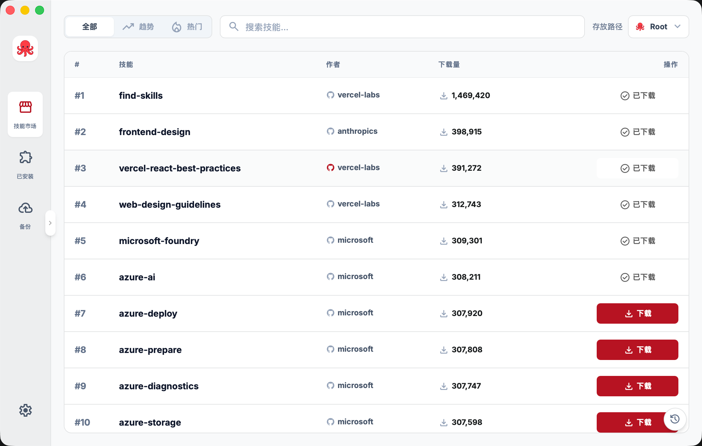
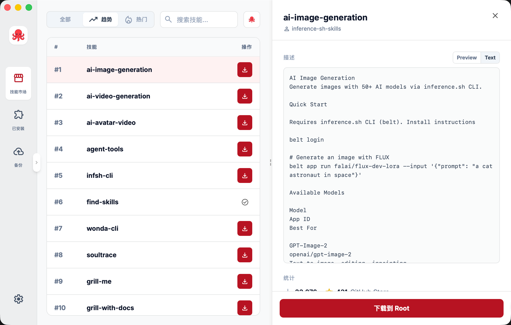
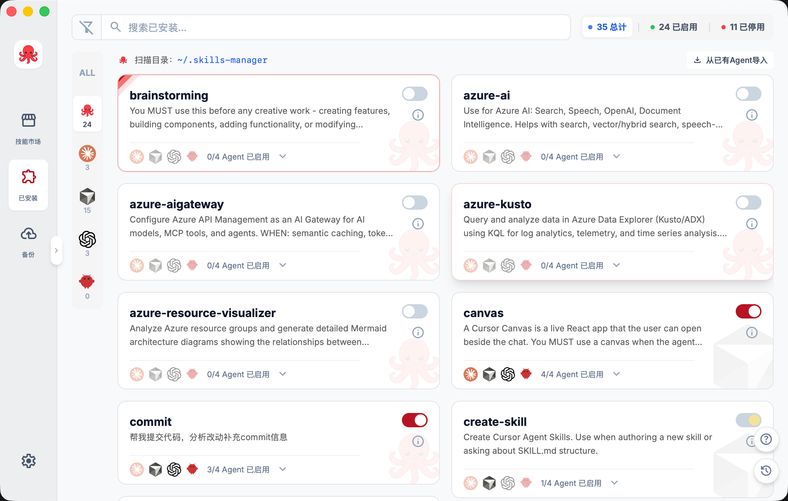
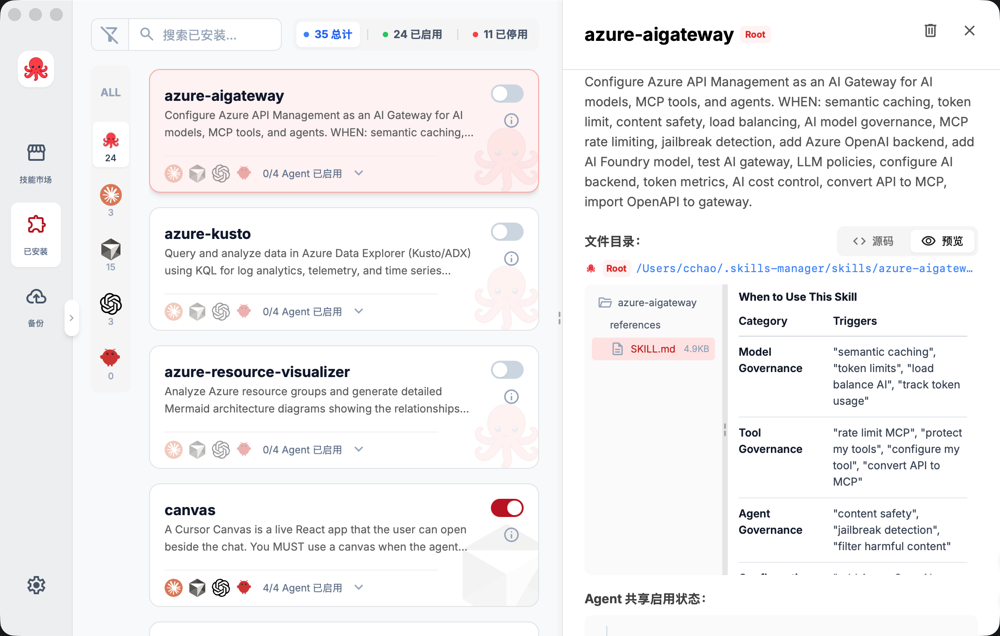
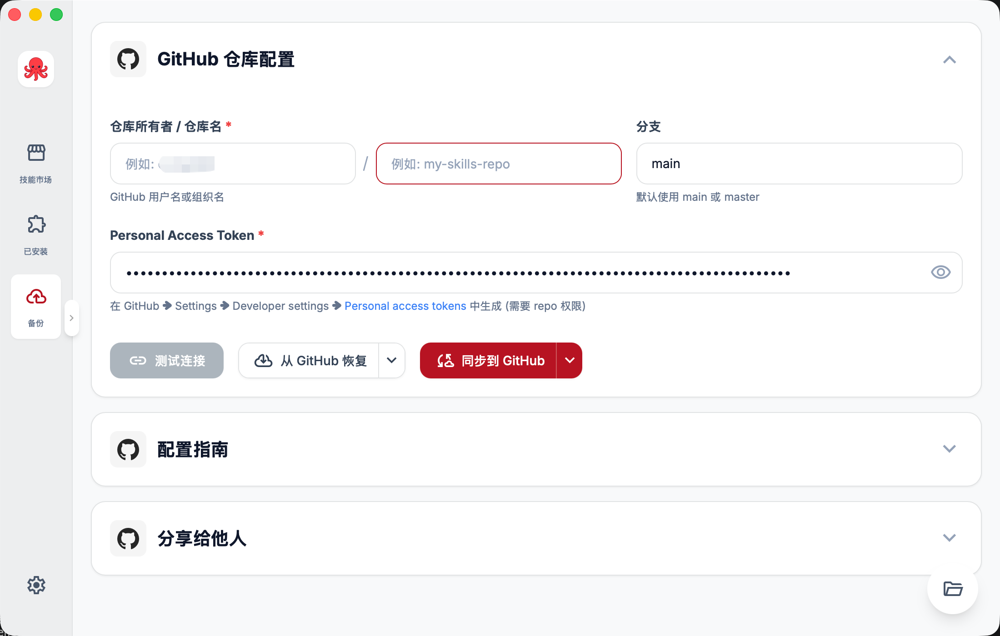
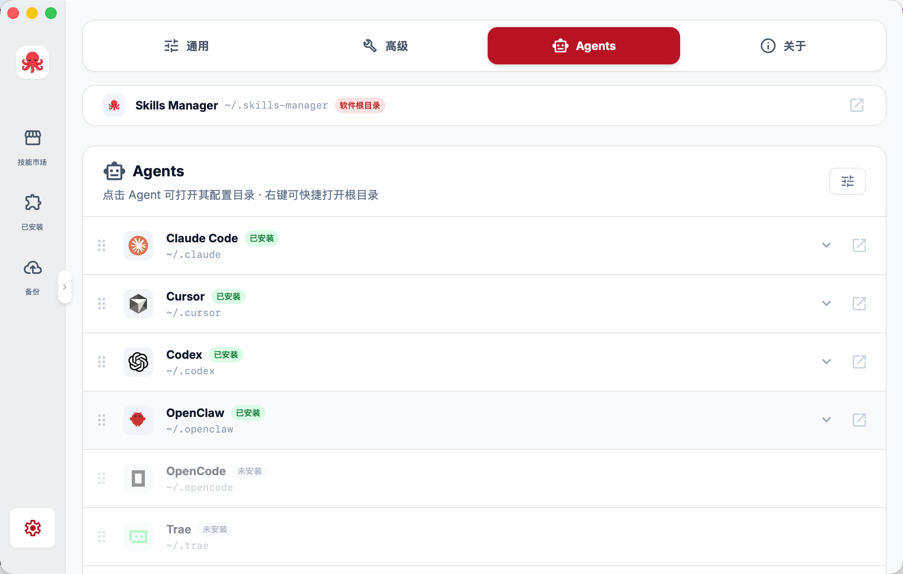

<div align="center">


### AI Agent 間で Skills を管理・同期・配布するためのデスクトップアプリ

[](https://tauri.app/)
[](https://react.dev/)
[](https://www.typescriptlang.org/)
[](LICENSE)
[](README.ja.md)

<p>
  <strong>Readme language / 文档语言 / ドキュメント言語</strong><br />
  <a href="README.md">中文</a> · <a href="README.en.md">English</a> · <b>日本語</b>
</p>

<p>
  <a href="https://github.com/cchao123/skills-manager/releases">最新版をダウンロード</a> ·
  <a href="docs/user-guide-en.md">ユーザーガイド</a> ·
  <a href="https://github.com/cchao123/skills-manager/issues">フィードバック</a>
</p>

</div>

---

## Skills Manager とは

**Skills Manager** は、**Tauri 2 + React + Rust** で作られたデスクトップアプリです。複数の AI Agent のディレクトリに分散した skills を 1 つの画面にまとめ、確認、有効化、配布、バックアップをしやすくします。

主に次のようなワークフローのために作られています。

- **分散を減らす**: 複数 Agent の skills を 1 つの UI で管理し、フォルダ間を行き来する手間を減らします。
- **再利用を速くする**: 同じ skill をリンクまたはコピーして、複数の Agent にすばやく配布できます。
- **バックアップと移行を簡単にする**: skills リポジトリを GitHub に同期し、新しいマシンで復元できます。
- **便利な skills を見つける**: 内蔵 Marketplace からコミュニティの skills を検索、プレビュー、インストールできます。

現在の組み込み Agent プリセットは **Claude Code, Cursor, Codex, OpenClaw, OpenCode, Trae, Qoder, Antigravity, Kiro** です。

---

## 機能概要

### Marketplace

- `skills.sh` のコミュニティ skills を閲覧
- **All Time / Trending / Hot** ランキングの切り替え
- 名前または説明で検索
- `SKILL.md`、統計情報、インストール先をプレビュー
- Root または特定の Agent にワンクリックでインストール




### インストール済み Skills の管理

- 複数ソースの skills を 1 つの管理画面に集約
- Agent ごとの有効状態を切り替え
- ソース位置、ファイルツリー、詳細内容を確認
- `SKILL.md` を含むフォルダのドラッグアンドドロップ導入に対応




### GitHub バックアップと配布

- ローカル skills リポジトリを GitHub に同期
- GitHub から新しいマシンへ復元
- 整理した skills リポジトリを自分やチームで共有




---

## インストールと利用

1. [GitHub Releases](https://github.com/cchao123/skills-manager/releases) から最新ビルドをダウンロードします。
2. アプリをインストールして起動します。
3. 初回起動時に、ローカルの Agent ディレクトリが自動でスキャンされ、見つかった skills が表示されます。

詳しい手順は [docs/user-guide-en.md](docs/user-guide-en.md) を参照してください。

---

## ローカル開発

### 必要環境

- **Node.js 20+**、推奨は **pnpm 9**
- `rustup` で導入した **Rust stable**
- **macOS** で OpenSSL エラーが出る場合は、次を実行してください。

```bash
brew install openssl@3
export OPENSSL_DIR=$(brew --prefix openssl@3)
export PKG_CONFIG_PATH=$(brew --prefix openssl@3)/lib/pkgconfig
```

このリポジトリには `pnpm-lock.yaml` が含まれているため、以下のコマンドは再現性のために `pnpm` を使います。

### クローンと依存関係のインストール

```bash
git clone https://github.com/cchao123/skills-manager.git
cd skills-manager
pnpm install
```

### 開発環境の起動

```bash
pnpm tauri:dev
```

このコマンドは次を起動します。

- `http://localhost:5173` の Vite 開発サーバー
- Tauri のデスクトップウィンドウ
- フロントエンドのホットリロードと、通常の Tauri バックエンド再ビルドフロー

通常のブラウザでフロントエンドだけを開くと、一部機能はモックデータにフォールバックします。完全な動作確認は Tauri ウィンドウで行ってください。

### 任意: テレメトリと監視

必要に応じて `.env.example` を `.env` にコピーし、使う項目だけ設定できます。

```bash
cp .env.example .env
```

アプリは `.env`、`.env.local`、`src-tauri/.env` などの環境変数ファイルを読み込みます。主な変数は次の通りです。

- `VITE_ENABLE_TELEMETRY=false`: フロントエンドの telemetry を無効化
- `VITE_APTABASE_APP_KEY`: Aptabase のフロントエンドイベント分析
- `VITE_SENTRY_DSN`: フロントエンド React のエラー報告
- `SENTRY_DSN`: Rust の panic / error 報告

---

## ビルドとリリース

```bash
# Windows x64
pnpm tauri:build

# macOS Apple Silicon
pnpm tauri:build -- --target aarch64-apple-darwin

# macOS Intel
pnpm tauri:build -- --target x86_64-apple-darwin
```

ビルド成果物は次の場所に出力されます。

- `src-tauri/target/release/`
- `src-tauri/target/release/bundle/`

Rust だけを素早く確認したい場合:

```bash
cargo build --manifest-path=src-tauri/Cargo.toml
```

このリポジトリの GitHub 自動化:

- リリースビルド: `.github/workflows/build.yml`
- Pages ドキュメントデプロイ: `.github/workflows/deploy-pages.yml`

---

## 設定とデータパス

- アプリ設定: `~/.skills-manager/config.json`
- 中央 skills ディレクトリ: `~/.skills-manager/skills/`
- GitHub 設定: `~/.skills-manager/github-config.json`

Skill のメタデータは主に各ディレクトリ内の **`SKILL.md`** から読み取られます。`name` や `description` を含む YAML frontmatter の利用を推奨します。

---

## リポジトリ構成

```text
skills-manager/
|-- .github/workflows/
|   |-- build.yml
|   `-- deploy-pages.yml
|-- app/
|   `-- src/
|       |-- pages/
|       |   |-- Dashboard/
|       |   |-- GitHubBackup/
|       |   |-- Marketplace/
|       |   `-- Settings/
|       `-- api/
|-- docs/
|-- scripts/
|-- src-tauri/
|   `-- src/
|       |-- commands/
|       `-- ...
|-- .env.example
|-- README.md
|-- README.en.md
`-- README.ja.md
```

---

## トラブルシューティング

| 症状 | 試すこと |
|------|----------|
| アイコン形式エラー | `npx @tauri-apps/cli icon <source-image>` でアイコンを再生成する |
| ポート 5173 が使用中 | ポートを解放するか、Vite のポート設定を変更する |
| macOS の OpenSSL エラー | `OPENSSL_DIR` と `PKG_CONFIG_PATH` を確認する |
| Skill 一覧が空 | Agent がインストール済みで、パスが存在し、`SKILL.md` があることを確認してから再スキャンする |
| Marketplace が読み込めない | `skills.sh` へのネットワークアクセスを確認する |
| GitHub バックアップに失敗する | token にリポジトリの読み書き権限があり、設定が正しいことを確認する |
| Skill のインストールに失敗する | 対象 Agent ディレクトリが存在し、書き込み可能で、ディスク容量が十分か確認する |

ドキュメントとコードが食い違う場合は、現在のコードを信頼してください。

---

## コントリビューション

Issue や Pull Request は [GitHub Issues](https://github.com/cchao123/skills-manager/issues) から歓迎します。

1. リポジトリを fork する
2. ブランチを作成する: `git checkout -b feature/your-feature`
3. 変更を commit して push する
4. Pull Request を作成する

push 前には、次を実行しておくと安心です。

```bash
pnpm build
cargo build --manifest-path=src-tauri/Cargo.toml
```

---

## ライセンス

このプロジェクトは **MIT License** のもとで公開されています。詳しくは [LICENSE](LICENSE) を参照してください。

---

## 謝辞

- [Tauri](https://tauri.app/)
- [Material Symbols](https://fonts.google.com/icons)
- [Claude Code](https://claude.ai/code)
