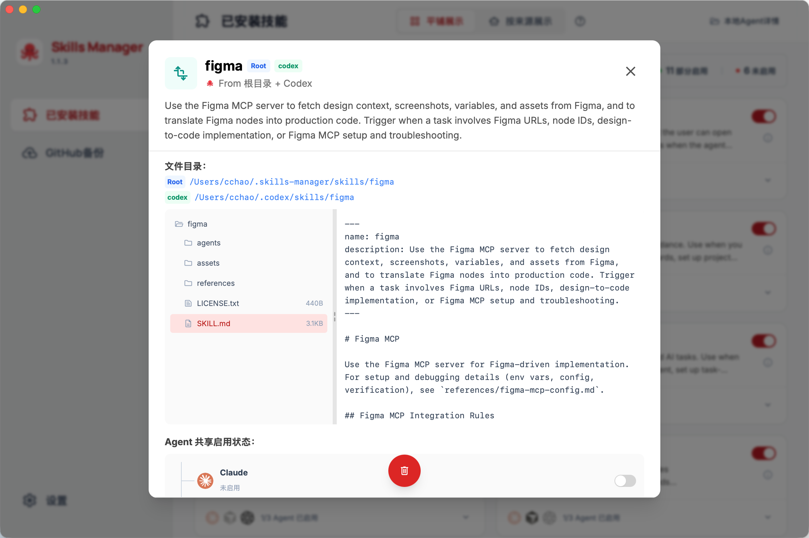
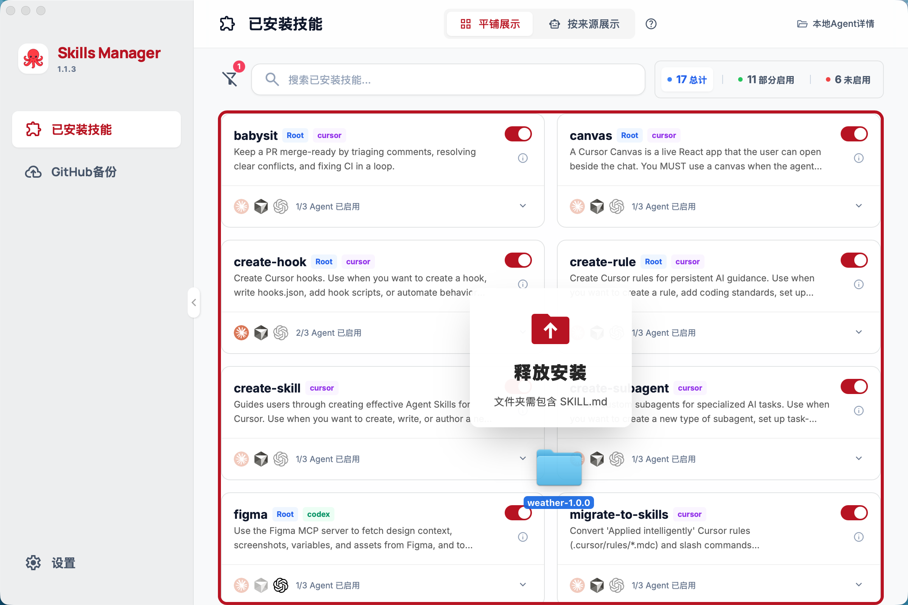

<div align="center">


### 在多个 AI Agent 之间管理、同步和分发 Skills 的桌面应用。


[](https://tauri.app/)
[](https://reactjs.org/)
[](https://www.typescriptlang.org/)
[](LICENSE)
[](README.md)

<p>
  <strong>文档语言 / Readme language</strong><br />
  <b><a href="#zh">中文</a></b> · <a href="README.en.md">English</a>
</p>

<p><a href="https://github.com/cchao123/skills-managers/issues">意见反馈（GitHub Issues）</a></p>

</div>

---

<a id="zh"></a>

## Skills Manager 是什么

**Skills Manager** 是一个基于 **Tauri 2 + React + Rust** 的桌面应用，用来统一管理本地 Skills，并在不同 AI Agent 之间完成扫描、共享、同步和恢复。

它当前围绕以下工作流展开：

- **统一扫描**：聚合本地多个 Agent 的 skill 目录，合并成一份可管理视图
- **跨 Agent 分发**：通过链接或复制，把同一个 skill 分发到不同 Agent
- **集中存储**：把可复用的 skills 放进中心目录，便于维护与迁移
- **GitHub 备份与恢复**：将技能仓库推送到远端，或在新机器上一键恢复

默认支持的 Agent 包括：**Claude、Cursor、Codex、OpenClaw、OpenCode**。

---

## 功能概览

### Skills 总览与管理

- **统一视图**：把来自不同来源的 skills 聚合到一个界面中管理
- **跨 Agent 开关**：通过总开关 / 子开关控制 skill 在不同 Agent 中的启用状态
- **多来源查看**：查看 skill 的详情、来源和文件结构
- **拖拽导入**：支持将包含 `SKILL.md` 的文件夹直接拖入导入





### GitHub 备份与分发

- **同步到 GitHub**：将本地 skills 仓库推送到远端
- **从 GitHub 恢复**：在新机器上拉取远端仓库并恢复本地 skills
- **分发技能仓库**：把整理好的 skills 作为共享仓库提供给自己或团队使用


### 设置

- **扫描与检测**：查看和管理本地已检测到的 Agent
- **链接策略**：按需选择以链接或复制的方式分发 skill
- **过滤规则**：过滤由 CLI / workflow 注入的 skill，保持列表清爽
- **删除保护**：默认避免直接改动 Agent 目录下的文件，需要手动开启相关操作


---

## 技术栈

| 层级 | 技术 |
|------|------|
| 前端 | React 18、TypeScript、Vite 5、Tailwind CSS、react-i18next |
| 桌面 | Tauri 2（Rust） |
| 典型依赖 | serde、git2、ureq、walkdir 等 |

开发与构建需安装 **Node.js**、**Rust**；在 macOS 上编译部分原生依赖时可能需要 **OpenSSL**（见下文）。

---

## 快速开始

### 环境要求

- **Node.js 18+**（`npm` 或 `pnpm`，与仓库锁文件一致即可）
- **Rust**（`rustup` 安装 stable）
- **macOS**：若遇 OpenSSL 相关报错，可用 Homebrew：
  ```bash
  brew install openssl@3
  export OPENSSL_DIR=$(brew --prefix openssl@3)
  export PKG_CONFIG_PATH=$(brew --prefix openssl@3)/lib/pkgconfig
  ```

### 克隆与安装

```bash
git clone <仓库地址>
cd skills-managers
npm install
```

### 可选：启用统计与监控（Aptabase + Sentry）

项目会按需读取 `.env` / `.env.local` / `src-tauri/.env` 等环境变量文件。若你需要启用统计或监控，可自行创建 `.env` 并填写以下变量：

- `APTABASE_APP_KEY`：事件统计（前端 `trackEvent` + Rust 生命周期事件）
- `VITE_SENTRY_DSN`：前端 React 错误上报
- `SENTRY_DSN`：Rust 侧 panic / error 上报
- `VITE_ENABLE_TELEMETRY=false`：可一键关闭前端 telemetry

### 开发调试

```bash
npm run tauri:dev
```

将启动 Vite（默认 `http://localhost:5173`）并打开桌面窗口；前端支持热更新，后端修改后按 Tauri 常规流程重新编译。

在**纯浏览器**中打开前端时，部分能力会使用 Mock 数据，完整功能请在 Tauri 窗口中使用。

---

## 构建发布

```bash
# Windows x64
npm run tauri:build

# macOS（按需指定 target，详见 Tauri 文档）
npm run tauri:build -- --target aarch64-apple-darwin
npm run tauri:build -- --target x86_64-apple-darwin
```

产物位于 `src-tauri/target/release/` 及 `src-tauri/target/release/bundle/`（安装包视平台而定）。

仅改 Rust 时可加快迭代：

```bash
cargo build --manifest-path=src-tauri/Cargo.toml
```

---

## 配置与数据位置（摘要）

- 应用配置：`~/.skills-manager/config.json`（技能启用状态、Agent、语言等）
- 中央技能目录：`~/.skills-manager/skills/`
- GitHub 配置：`~/.skills-manager/github-config.json`

技能元数据来自各目录下的 **`SKILL.md`**（建议含 YAML frontmatter：`name`、`description` 等）。

---

## 常见问题

| 现象 | 处理方向 |
|------|----------|
| 图标格式报错 | 使用 `npx @tauri-apps/cli icon <源图>` 生成符合要求的图标集 |
| 5173 端口占用 | 结束占用进程或修改 Vite 端口配置 |
| macOS OpenSSL | 设置上文 `OPENSSL_DIR` / `PKG_CONFIG_PATH` |
| 列表里没有技能 | 确认本机已安装对应 Agent、技能路径存在且含 `SKILL.md`，在界面中执行重新扫描 |

更多截图、说明和静态文档可参考 **`docs/`** 目录；若文档与代码不一致，以当前代码实现为准。

---

## 项目结构（简）

```
skills-manager/
├── app/                 # React 前端（Vite）
├── src-tauri/           # Tauri + Rust 后端
├── docs/                # 文档与资源（如 docs/assets/logo.png）
├── LICENSE
├── README.md
└── README.en.md         # 英文说明
```

---

## 参与贡献

欢迎通过 [GitHub Issues](https://github.com/cchao123/skills-managers/issues) 反馈与讨论，也欢迎 Pull Request：功能改进、文档、国际化、Bug 修复等。

1. Fork 本仓库  
2. 新建分支：`git checkout -b feature/your-feature`  
3. 提交修改并推送  
4. 发起 Pull Request  

提交前建议在本地执行 **`npm run build`**（含 `tsc`）与 **`cargo build`**，减少 CI 失败。

---

## 开源协议

本项目以 **MIT License** 发布，详见仓库内 [`LICENSE`](LICENSE)。

英文说明见 **[`README.en.md`](README.en.md)**。

---

## 致谢 · Acknowledgments

- [Tauri](https://tauri.app/) · [Material Symbols](https://fonts.google.com/icons) · [Claude Code](https://claude.ai/code)
